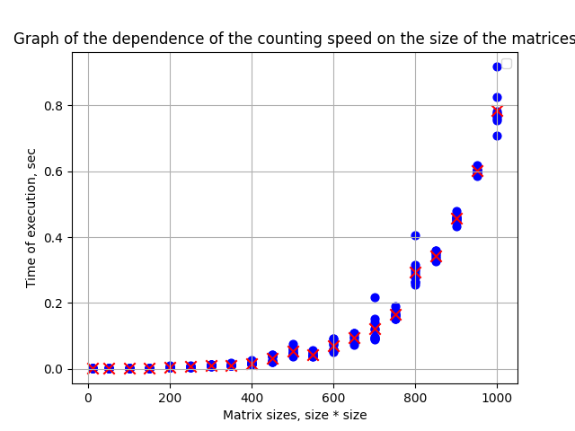

### ОТЧЕТ ПО 1 ЛАБОРАТОРНОЙ РАБОТЕ

##### ТЗ

Написать программу на языке C/C++ для перемножения двух матриц. Исходные данные: файл(ы) содержащие значения исходных матриц. Выходные данные: файл со значениями результирующей матрицы, время выполнения, объем задачи. Обязательна автоматизированная верификация результатов вычислений с помощью сторонних библиотек или стороннего ПО (например на Matlab/Python).

##### Реализация

В рамках работы была реализована система взаимодействия между программой на C++ и Python. Основная цель заключалась в передаче данных между языками, запуске исполняемого файла C++ из Python и анализе результатов вычислений. 
На C++ была написана программа multipllier.cpp, в функции main которого производились вычисления произведения матриц посредством чтения самих матриц, проверки требований к перемножению (при этом сами матрицы генерируются по заданным пользователем параметрам), после чего непосредственного умножения матриц (с фиксацией времени, за которое умножение прозводилось, в консоль) и вывода результата в файл. 
На Python была написана программа check_and_display.py, которая обращается к собранному исполняемому файлу multiplier.exe (использовался subprocess) с заданными параметрами (для упрощения использовались квадратные матрицы), после чего время, за которое производилось умножение, записывается в массив для дальнейшей демонстрации скорости исполнения задачи для каждого размера матрицы; перемножение производилось для каждого размера матриц несколько раз, на графике видно средний показатель по 10 вычислениям (отмечен красным крестом). После завершения вычислений открывается график зависимости скорости исполнения от размера матриц (использовался matplotlib), который также сохраняется автоматически по указанному в программе пути в формате .png.

##### Результаты сравнения

Из графика видно, что сложность близка к O(n^3)